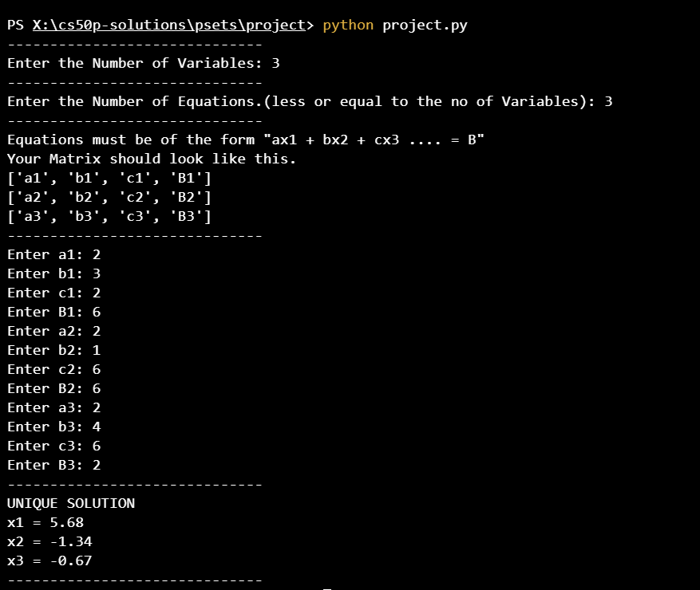
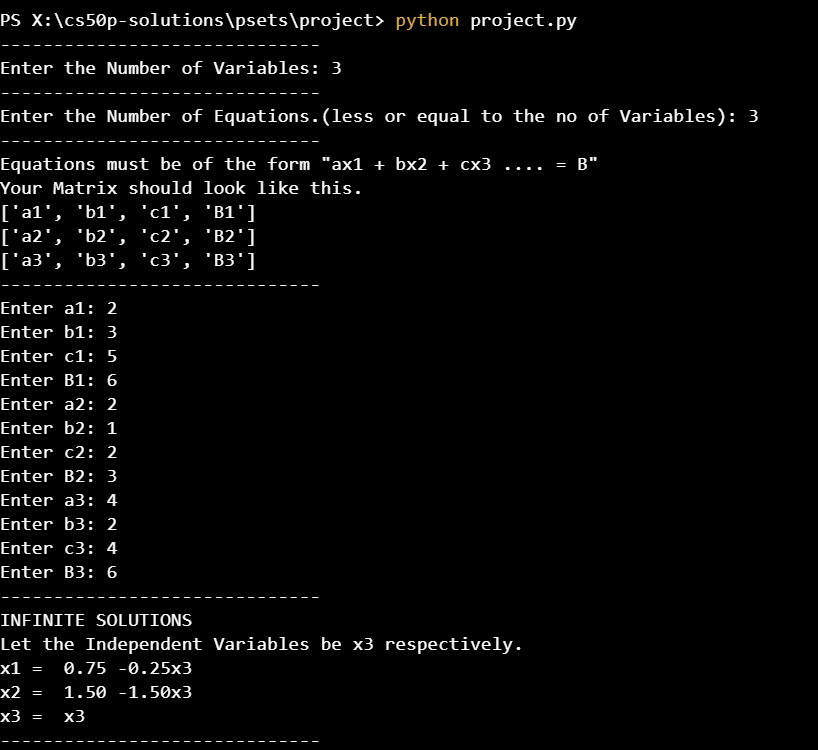
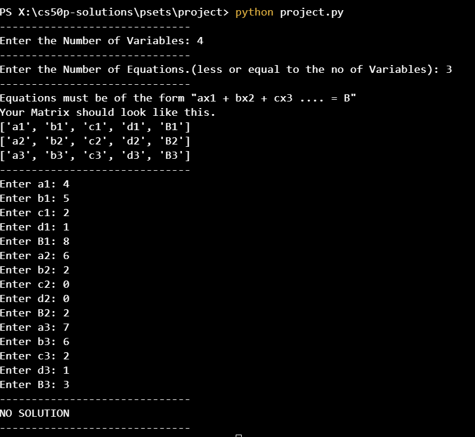

# LINEAR EQUATIONS SOLVER
#### Video Url - https://youtu.be/mjkTxAcqs4A

I opted to implement the Echelon method to transform the matrix into Echelon form, and subsequently into Reduced Row Echelon Form (RREF). This approach allows for efficiently determining the type of solutions for a system of n linear equations with m variables, without relying on external libraries. It is particularly effective for handling any number of equations in a systematic manner.
## Features
For linear Equations :-
- Unique Solution: Provide the specific values for each variable.
- Infinite Solutions: Express the solutions using variables.
- No Solution: Indicate that there is no valid solution.


## Run Locally

Clone the project

```bash
  git clone https://github.com/harsh-awasthik/CS50P-Solutions.git
```

Go to the project directory

```bash
  cd psets/project
```


## Usage/Examples

### Example 1

For equations like:

$$
\begin{cases}
2x_1 + 3x_2 + 2x_3 = 6 \\
2x_1 + x_2 + 6x_3 = 6 \\
2x_1 + 4x_2 + 6x_3 = 2 \\
\end{cases}
$$

The code will:



### Example 2

For equations like:

$$
\begin{cases}
2x_1 + 3x_2 + 5x_3  = 6\\
2x_1 + x_2 + 2x_3 = 3 \\
4x_1 + 2x_2 + 4x_3 = 6 \\
\end{cases}
$$

The code will:



### Example 3

For equations like:

$$
\begin{cases}
4x_1 + 5x_2 + 2x_3 + x_4 = 8\\
6x_1 + 2x_2 = 2\\
7x_1 + 6x_2 + 2x_3 + x_4 = 3 \\
\end{cases}
$$

The code will:



## Running Tests

To run tests, run the following command

```bash
  pip install pytest
  pip install numpy
  pytest test_project.py
```

## Learning Experiences
This experience taught me the importance of Run and Debug function in python
Round function and robust error handling in software development. Also gains my experience by a lot in pytest library
Also I have not taken help from ai (simple fact is they can’t help) nor by the internet as there is no website which creates Echelon form and Reduced Echelon form directly (as taught in most of the schools)


## Support

For support, email harsh.awasthik@gmail.com


## 🔗 Links

[](https://www.linkedin.com/in/harsh-awasthi-746b64277/)

